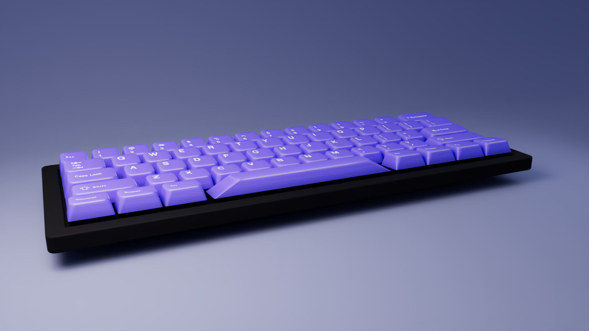

<div align="center">

# Keycap Studio

**Design a keycap set, preview it in real-time 3D, export marketing-grade renders — all in the browser.**

**[▶ Try it live](https://mohamedzameell.github.io/keycap-studio/)**




<sub>↑ rendered **in the browser** — path traced + AI denoised, no Blender, no server, $0</sub>

</div>

---

## Why

Keycap set designers juggle KLE for layout, Photoshop templates for color, keysim for 3D — then pay $50–300 for a commissioned Blender render before an Interest Check. Keycap Studio is the whole pipeline in one tab:

- **Design** — any layout, any profile, full per-zone + per-key colorway authoring
- **Preview** — product-photo-grade real-time 3D
- **Export** — path-traced studio shots up to 4K, straight from the EXPORT tab

## Features

### Design
- **Colorway editor** — author custom colorways with alphas / mods / accent zones + per-key paint, cloud-synced when signed in
- **72 GMK presets** — multi-color rules mapped per key group
- **Legend engine** — profile-correct typesetting, 10 international sub-legend scripts (Hiragana, Cyrillic, Hangul, …), front-face legends, custom text per key
- **11 profiles** — Cherry, SA, DSA, OEM, XDA, KAT, MT3, ASA, OSA, KSA, low-profile
- **Form factors** — 60%, 65%, 75%, TKL, 100% · case style / finish / color

### Hero Render (the party trick)
- **In-browser path tracing** (`three-gpu-pathtracer`) with OIDN AI denoising — Cycles-class stills, zero install
- **HD / QHD / 4K** × **16:9 / 1:1 / 4:5** × 4 camera presets
- **Transparent background** export for thumbnails and banners
- Studio staging: softbox key light, cyclorama sweep, backdrop auto-harmonized to your colorway

### Share & extras
- **Share URLs** encode the full design — custom colorways included, they open on any device
- **Typing test** at `/typing-test` — Monkeytype-style words with live 3D key presses
- PNG / PDF / SVG export · image wrap across caps · Supabase auth + gallery

## Tech

| Layer | Choice |
|---|---|
| Framework | React 19 + Vite 8 |
| 3D | Three.js via `@react-three/fiber` + `@react-three/drei` |
| Path tracing | `three-gpu-pathtracer` + `three-mesh-bvh` |
| Denoising | `denoiser` (OIDN weights, tfjs) |
| State | Zustand |
| Routing | React Router 7 |
| Auth / DB | Supabase |
| Styling | Inline styles + CSS variables in `src/index.css` |

## What's Done

- [x] Product-photo rendering: rounded fillet geometry, studio softbox, real cap measurements, convex spacebar
- [x] GMK multi-color colorway system + custom colorway editor with cloud sync
- [x] Legend engine v2 — intl sub-legends, SA typesetting, front-face legends
- [x] Hero render mode — path traced, denoised, 4K, transparent bg, vignette
- [x] Share URLs that carry the entire design cross-device
- [x] Public deploy on GitHub Pages
- [x] Typing test with live key press animation

## Still Improving

- [ ] Render gallery — save hero shots to your account
- [ ] KLE import · ISO layouts · kit awareness (base vs novelties)
- [ ] Turntable GIF/MP4 export
- [ ] iOS Safari pass

## Run Locally

```bash
git clone https://github.com/MohamedZameell/keycap-studio.git
cd keycap-studio
npm install
npm run dev
# → http://localhost:5173
```

Optional: copy `.env.example` to `.env` with your Supabase project for auth/sync. The app runs fully local without it.

**Deploy:** `npm run deploy` — builds and publishes to GitHub Pages (`gh-pages` branch).

## Key Files

- `src/components/Keycap.jsx` — 3D keycap geometry + `PROFILE_SPECS`
- `src/hero/` — path-traced hero render pipeline (stage, modal, bridge)
- `src/data/colorways/` — 72 GMK colorway JSON files
- `src/data/customColorways.js` — custom colorway registry
- `src/screens/StudioScreen.jsx` — main editor
- `src/store.js` — Zustand store

## Reference Material

Bundled in `/references/` — keysim source, GMK color list, KL3V, KLE-Render, KeycapModels. Used as the visual north star for rendering quality.

---

<sub>Vibe-coded with Claude Code and Codex. Designed and maintained by <a href="https://github.com/MohamedZameell">@MohamedZameell</a>.</sub>
